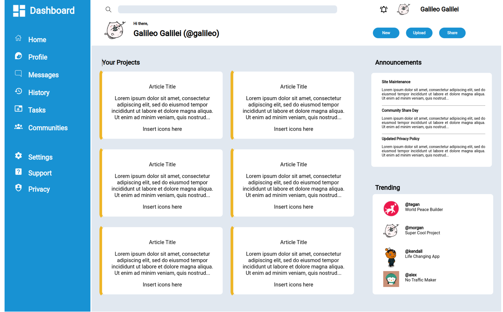

  

  <h1 align="center"><b>Sign-up Form</b></h1>

 

## Preview

 

 

<a href="https://fubiknees.github.io/Admin-Dashboard/">View Demo</a>
 

## Goal

* Recreate layout design from scratch (Top Picture-Sample layout; Bottom picture- Recreation)

* [Assignment Details](https://www.theodinproject.com/lessons/node-path-intermediate-html-and-css-admin-dashboard)

 

## Built With

*    
*    

 

## Takeaways

* More fluidity creation via CSS/HTML

 

## Improvements

* I left out the lower right icons on each card due to oversight. I debated fixing it but I believe my time is better served moving to the next module - JS data structures and algorithms.

